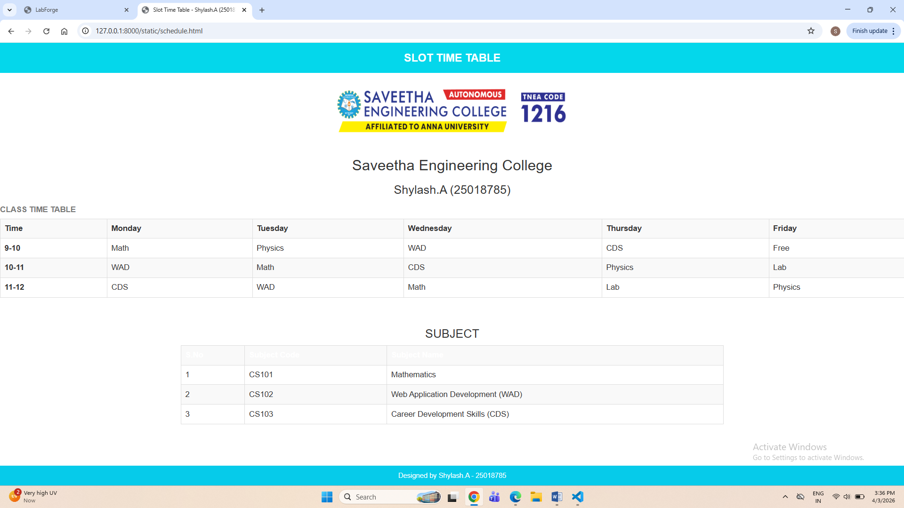

# Ex08 CAMU Schedule using Bootstrap
## Date:

## AIM:
To design a responsive and visually appealing CAMU Schedule using Bootstrap.

## DESIGN STEPS:

### Step 1:
Clone the repository from GitHub.

### Step 2:
Create Django Admin project.

### Step 3:
Create a New App under the Django Admin project.

### Step 4:
Add the Bootstrap CDN link inside the ```<head>``` section.

### Step 5:
Insert a table element with Bootstrap table classes.

### Step 6:
Construct the complete table.

### Step 7:
Add a header/footer displaying copyright information.

### Step 8:
Publish the website in the LocalHost.

## PROGRAM :
```
schedule.html

<html>
<head>
    <title>Slot Time Table - Shylash.A (25018785)</title>

    <link rel="stylesheet" href="https://maxcdn.bootstrapcdn.com/bootstrap/3.4.1/css/bootstrap.min.css">
    <script src="https://ajax.googleapis.com/ajax/libs/jquery/3.7.1/jquery.min.js"></script>
    <script src="https://maxcdn.bootstrapcdn.com/bootstrap/3.4.1/js/bootstrap.min.js"></script>

    <style>
        header {
            position: sticky;
            top: 0;
            width: 100%;
            background-color: #04d7eb;
            color: white;
            font-weight: bold;
            text-align: center;
            padding: 15px;
            font-size: 22px;
        }

        body {
            text-align: center;
        }

        img {
            margin: 15px 0;
        }

        table {
            margin: auto;
        }

        footer {
            position: fixed;
            bottom: 0;
            width: 100%;
            background-color: #06cbea;
            color: white;
            text-align: center;
            padding: 10px;
        }
    </style>
</head>

<body>

<header>
    SLOT TIME TABLE
</header>


<h2>Saveetha Engineering College</h2>
<h3>Shylash.A (25018785)</h3>

<table class="table table-bordered table-hover table-striped">
    <caption><b>CLASS TIME TABLE</b></caption>

    <tr class="bg-success">
        <th>Time</th>
        <th>Monday</th>
        <th>Tuesday</th>
        <th>Wednesday</th>
        <th>Thursday</th>
        <th>Friday</th>
    </tr>

    <tr>
        <th>9-10</th>
        <td>Math</td>
        <td>Physics</td>
        <td>WAD</td>
        <td>CDS</td>
        <td>Free</td>
    </tr>

    <tr>
        <th>10-11</th>
        <td>WAD</td>
        <td>Math</td>
        <td>CDS</td>
        <td>Physics</td>
        <td>Lab</td>
    </tr>

    <tr>
        <th>11-12</th>
        <td>CDS</td>
        <td>WAD</td>
        <td>Math</td>
        <td>Lab</td>
        <td>Physics</td>
    </tr>

</table>

<br>

<h3>SUBJECT</h3>

<table class="table table-bordered table-striped" style="width:60%">
    <tr class="bg-primary">
        <th>S.No</th>
        <th>Subject Code</th>
        <th>Subject Name</th>
    </tr>

    <tr>
        <td>1</td>
        <td>CS101</td>
        <td>Mathematics</td>
    </tr>

    <tr>
        <td>2</td>
        <td>CS102</td>
        <td>Web Application Development (WAD)</td>
    </tr>

    <tr>
        <td>3</td>
        <td>CS103</td>
        <td>Career Development Skills (CDS)</td>
    </tr>
</table>

<footer>
    Designed by Shylash.A - 25018785
</footer>

</body>
</html>

```

## OUTPUT:

## RESULT:
A responsive and visually appealing CAMU Schedule web page using Bootstrap is designed successfully.
